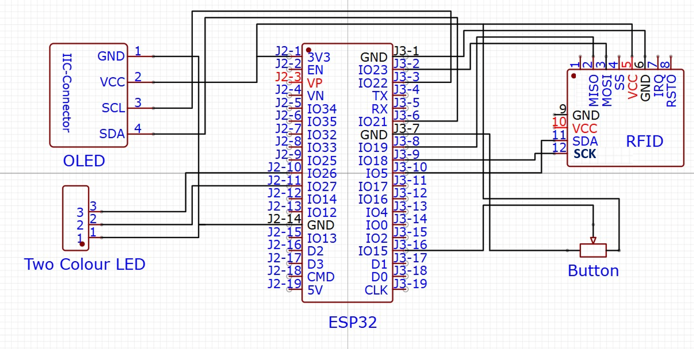
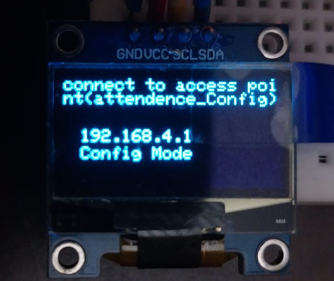
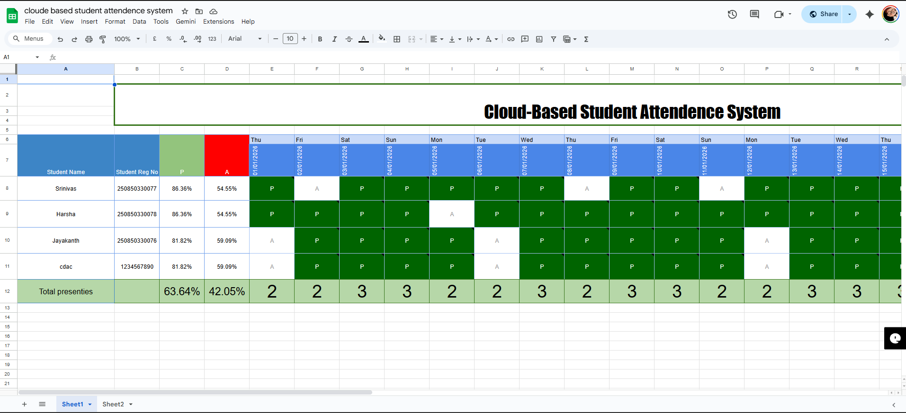
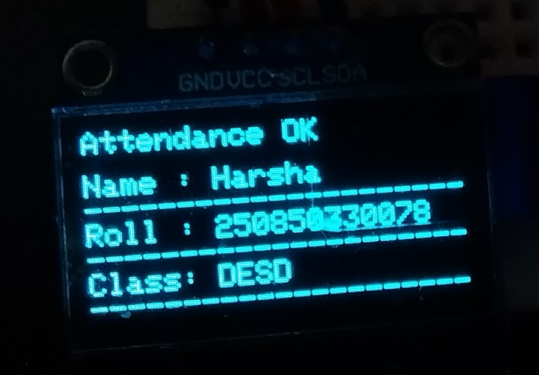

# 📡 Cloud-Based RFID Attendance System

A secure, scalable, and cloud-connected RFID attendance system using **ESP32, MQTT, Raspberry Pi, and Google Sheets** for real-time attendance tracking.

---

## 📌 Project Overview

Traditional attendance systems are time-consuming and prone to human error.  
This project implements an **automated RFID-based attendance system** with real-time cloud synchronization, local backup, and administrator control features.

---

## 🎯 Project Objectives

- Automate student attendance using RFID technology  
- Reduce human errors and manual effort  
- Provide real-time attendance logging  
- Support local and cloud data storage  
- Enable administrator configuration and maintenance  

---

## 🧰 Hardware Components

- ESP32  
- RFID Reader (MFRC522)  
- Raspberry Pi  
- OLED Display  
- LEDs and Buzzer  
- Wi-Fi Network  

---

## 💻 Software & Technologies Used

- Arduino IDE  
- Embedded C  
- Mosquitto MQTT Broker  
- Google Apps Script  
- Google Sheets  
- HTTP Protocol  

---

## 🧱 System Architecture

### 🔹 Block Diagram

---

### 🔹 Circuit Diagram

---

## ⚙️ Working Principle

1. Student scans the RFID card  
2. ESP32 reads the RFID UID  
3. UID is published to the MQTT broker  
4. Raspberry Pi subscribes and receives the UID  
5. Attendance is stored in the local database  
6. Data is sent to Google Sheets using HTTP  
7. OLED display and LEDs provide visual feedback  

---

## 🔄 Operating Modes

### 👨‍🎓 Student Mode (Default)

- Students scan RFID cards  
- Attendance is marked automatically  
- OLED displays attendance status  
- LEDs indicate success or failure  

### 👨‍💻 Administrator Mode

- Used for system configuration and maintenance  
- Allows Wi-Fi configuration and student management  
- Provides access to system logs and status  

---

## ⚙️ Configuration Mode (BOOT Button Method)

This system supports a **Configuration Mode** that is activated using the **ESP32 BOOT button (GPIO 0)** during power-up.  
This method is useful during **initial setup** or when **Wi-Fi credentials need to be updated**.

---

### 🔘 How to Enter Configuration Mode

1. Power **OFF** the ESP32 device  
2. **Press and HOLD** the **BOOT button**  
3. While holding the button, **Power ON / Reset** the device  
4. Keep holding for **2–3 seconds**  
5. Release the button  

➡️ The device will now start in **CONFIG MODE**

---

### 🧠 Configuration Mode Logic

- BOOT button (GPIO 0) is checked during startup  
- If the button is **LOW (pressed)** at boot time:
  - Device enters **Configuration Mode**
  - ESP32 starts in **Access Point (AP) mode**
  - OLED displays the **Configuration Screen**
- If the button is **not pressed**:
  - Device starts in **Normal (Student) Mode**

---

### 📟 OLED Display – Config Mode

When Configuration Mode is active, the OLED displays:
- **CONFIG MODE**
- **Access Point (AP) Name**
- **Device IP Address**
- Instructions to connect using a mobile or laptop

---

### 🌐 Configuration Features

In Configuration Mode, the administrator can:
- Configure **Wi-Fi SSID and Password**
- Save credentials to ESP32 flash memory (NVS)
- Restart the device after successful configuration

---

### 🔄 Exit Configuration Mode

- Restart the device **without pressing** the BOOT button  
- Device boots into **Student Mode** automatically  

---

## 🗄️ Database & Cloud Features

### 📍 Local Database

- Stores attendance during internet failure  
- Prevents data loss  

### ☁️ Cloud Integration

- Google Sheets used as cloud database  
- Time-stamped attendance logs  
- Automatic data synchronization  

### 🛠️ Admin Control Panel

- Dynamic Wi-Fi configuration  
- Student record management  
- Backup and restore support  

---

## 📊 Results & Performance

- ⏱️ **RFID Scan Time:** < 5 seconds  
- 📈 **System Uptime:** 99%  
- 🔁 Real-time cloud synchronization  
- 💡 OLED and LED visual feedback  

---

## 🌍 Real-World Applications

- Educational Institutions  
- Training Centers  
- Corporate Offices  
- Residential Hostels  

---

## 🚀 Future Scope

- Biometric authentication integration  
- Mobile application for teachers and parents  
- SMS and Email alert system  
- Advanced analytics dashboard  
- Multi-device connectivity  

---

## 📸 Project Demo Images

  
  
  

---

## 📜 Conclusion

This project successfully demonstrates a **secure, scalable, and real-time RFID attendance system** using MQTT and cloud technologies.  
The dual-database architecture ensures data reliability, while administrator controls enable easy system configuration and maintenance.

---

⭐ If you like this project, don’t forget to **star ⭐ the repository!**
